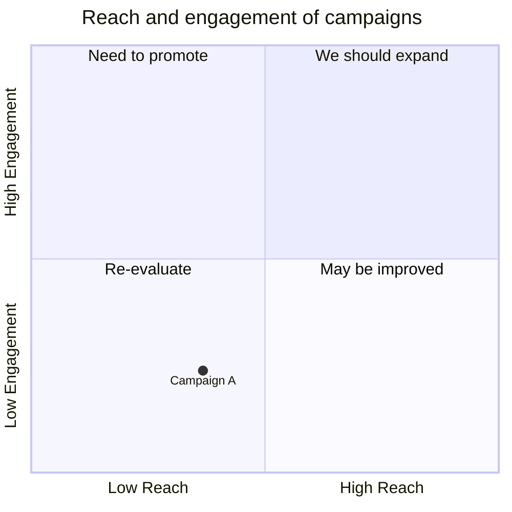

# Tropes 1500 is an updated version of the previous Tropes 20

The purpose behind Tropes 20 was to write a shorter method chapter to an edited volume. The purpose behind Tropes 1500 is to expand on that work and write a longer article on the same topic. That is, different biases in models for object detection in 1930s photographs, with a specific focus on men and women. The README of Tropes 1500 will be expanded further on.

# Below is the README of the previous tropes_20 concerning the 20 annotated images and statistics for more

## 20 Images

Each of the [selected images](/20_images.txt) are included four times:

- In their original [raw form](/000_raw/)
- With boxes from GroundingDino with different orders of the labels:
    - [Man - Woman](/DinoManWoman_th25/)
    - [Woman - Man](/DinoWomanMan_th25/)
- An out-of-the-box [Yolo](/yolos-pretrained_th75/) -- not trained on this
data and does therefore not support gender detection.

The drawn boxes include the label and `score`/`confidence` that the
respective model predicted for the image.

## Performance statistics

The subdirectory [statistics](/statistics/) contains performance statistics
for both DinoModels as well as the ViLT-VQA model. The calculations are split
into two parts:

1. Using only the [20 handpicked images](/statistics/20_picked/)

    - [ViLT-VQA](/statistics/20_picked/vilt-vqa/)

    - Dino[Man-Woman](/statistics/20_picked/DinoManWoman_th25/)

    - Dino[Woman-Man](/statistics/20_picked/DinoWomanMan_th25/)

2. Using all [1500 annotated images](/statistics/overall/)

    - [ViLT-VQA](/statistics/overall/vilt-vqa/)

    - Dino[Man-Woman](/statistics/overall/DinoManWoman_th25/)

    - Dino[Woman-Man](/statistics/overall/DinoWomanMan_th25/)

### VQA-questions

The VQA (ViLT-VQA) classifier is wrapper around a [public ViLT-VQA](https://huggingface.co/dandelin/vilt-b32-finetuned-vqa) model. The "Visual Question Answering" model is trained to answer questions about images -- it takes a image-question pair as its input and then spits out a short-list of answers (each with a confidence score). [The classifier](https://github.com/Modern36/VQA_classifier) asks the model a few questions about each image, converts the top answer to a binary response (it finding 5 women in the image is concerted to "yes") and then uses the arithmetic average of these answers as the final answer.

As of [`2024-08-28`](https://github.com/Modern36/VQA_classifier/blob/edac6a599727c3efd6ed584a40efba93d2ce6758/src/gender_classifiers.py)
this classifier uses seven questions each for determining if the model is able to detect a woman or a man in the image:

#### Male

 - How many adult males are depicted in the image?
 - Is there at least one adult male in the image?
 - Is there an adult male in the image?
 - How many adult males are depicted in the photograph?
 - Is there at least one adult male in the photograph?
 - Is there an adult male in the photograph?
 - A man somewhere?

#### Female

 - How many adult females are depicted in the image?
 - Is there at least one adult female in the image?
 - Is there an adult female in the image?
 - How many adult females are depicted in the photograph?
 - Is there at least one adult female in the photograph?
 - Is there an adult female in the photograph?
 - A woman somewhere?

## Data

The raw data underlying the above calculation [are included in](/data.csv).

The objects, with boxes and scores, found by each model for the 20
hannepicked images can be found in the [999_detect_data](/999_detect_data/)
subdirectory.

## Thresholds

The thresholds used are 75% (for yolo) and 25% (for GroundingDino), which
are arbitrarily chosen from default suggested values and previous
experiments -- they seem to be neither too restrictive or permissive.

