# Scatter found classes

 - **X-axis***: Ratio of images with men.
 - **Y-axis***: Ratio of images with women.

-  GroundTrut"
-  Dino
-  llama-des"
-  VQA

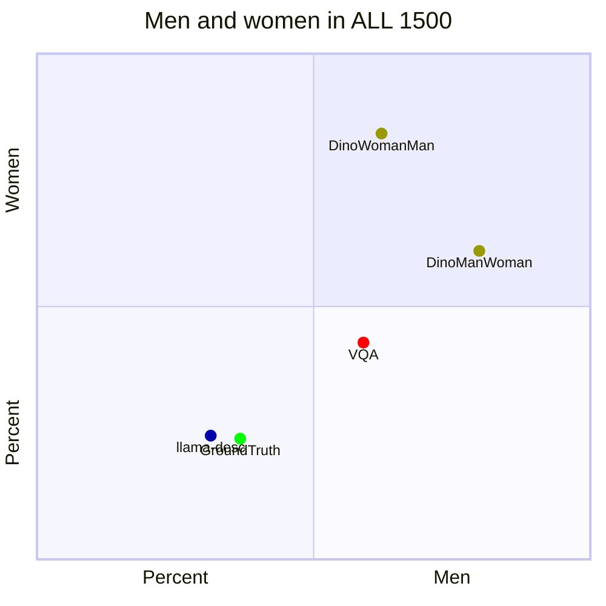
```mermaid
quadrantChart
    title Men and women in ALL 1500
    x-axis Percent --> Men
    y-axis Percent --> Women
    DinoManWoman: [0.7993333333333333, 0.61] color: #999900
    DinoWomanMan: [0.6226666666666667, 0.842] color: #999900
    GroundTruth: [0.36733333333333335, 0.23866666666666667] color: #00FF00
    VQA: [0.59, 0.42866666666666664] color: #FF0000
    llama-desc: [0.314, 0.24466666666666667] color: #0000AA

```

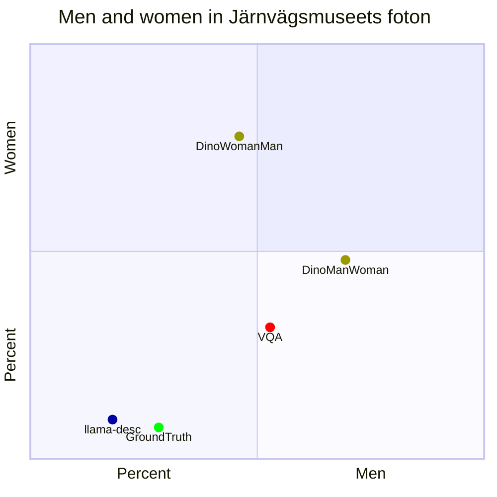
```mermaid
quadrantChart
    title Men and women in Järnvägsmuseets foton
    x-axis Percent --> Men
    y-axis Percent --> Women
    DinoManWoman: [0.6943396226415094, 0.47924528301886793] color: #999900
    DinoWomanMan: [0.46037735849056605, 0.7773584905660378] color: #999900
    GroundTruth: [0.2830188679245283, 0.07547169811320754] color: #00FF00
    VQA: [0.5283018867924528, 0.3169811320754717] color: #FF0000
    llama-desc: [0.1811320754716981, 0.09433962264150944] color: #0000AA

```

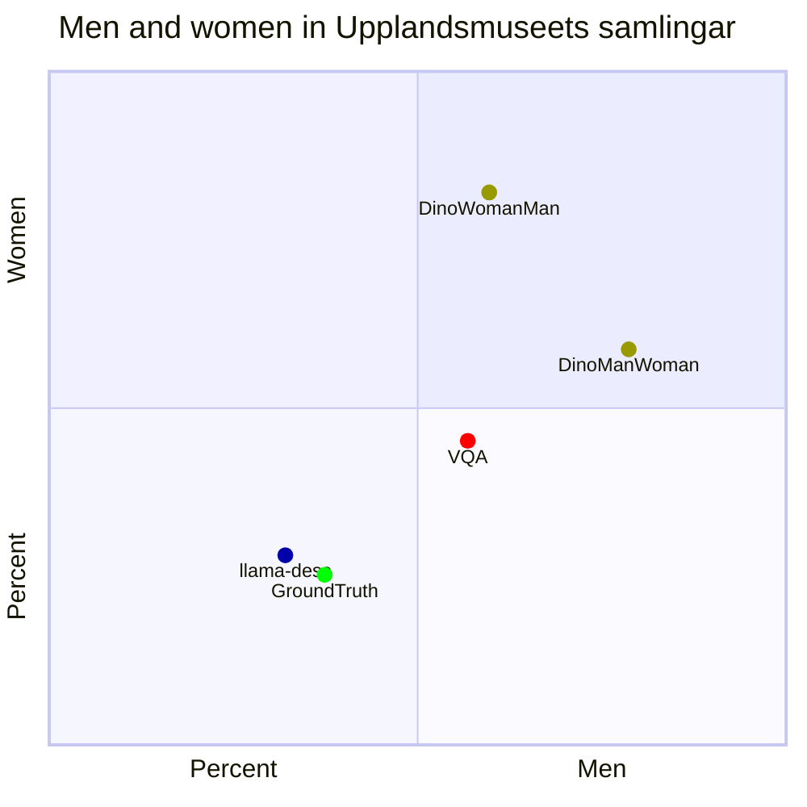
```mermaid
quadrantChart
    title Men and women in Upplandsmuseets samlingar
    x-axis Percent --> Men
    y-axis Percent --> Women
    DinoManWoman: [0.7864077669902912, 0.587378640776699] color: #999900
    DinoWomanMan: [0.5970873786407767, 0.8203883495145631] color: #999900
    GroundTruth: [0.3737864077669903, 0.2524271844660194] color: #00FF00
    VQA: [0.5679611650485437, 0.45145631067961167] color: #FF0000
    llama-desc: [0.32038834951456313, 0.2815533980582524] color: #0000AA

```

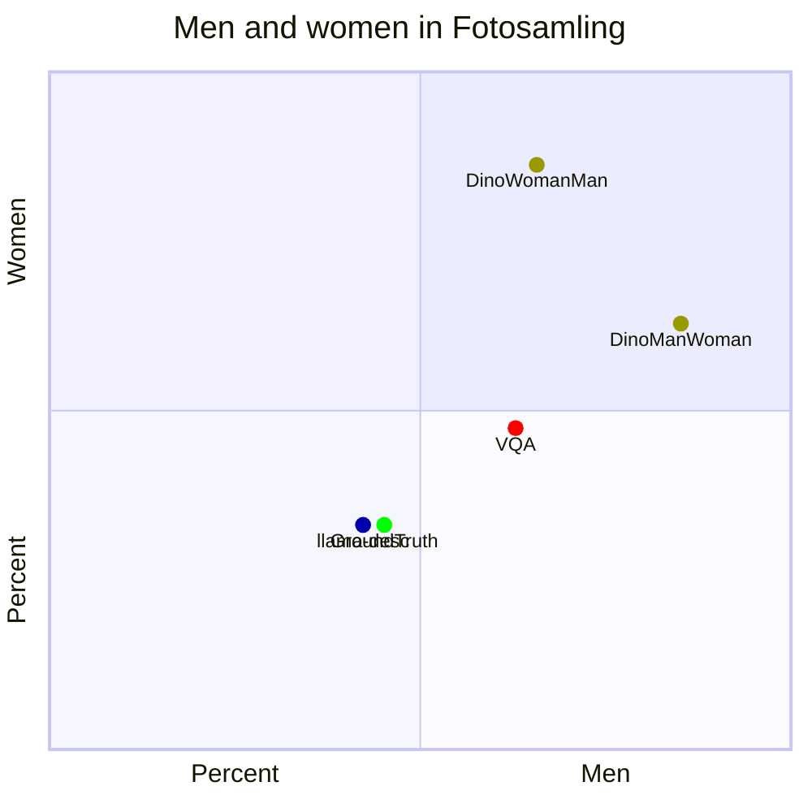
```mermaid
quadrantChart
    title Men and women in Fotosamling
    x-axis Percent --> Men
    y-axis Percent --> Women
    DinoManWoman: [0.8514285714285714, 0.6285714285714286] color: #999900
    DinoWomanMan: [0.6571428571428571, 0.8628571428571429] color: #999900
    GroundTruth: [0.4514285714285714, 0.3314285714285714] color: #00FF00
    VQA: [0.6285714285714286, 0.4742857142857143] color: #FF0000
    llama-desc: [0.4228571428571429, 0.3314285714285714] color: #0000AA

```

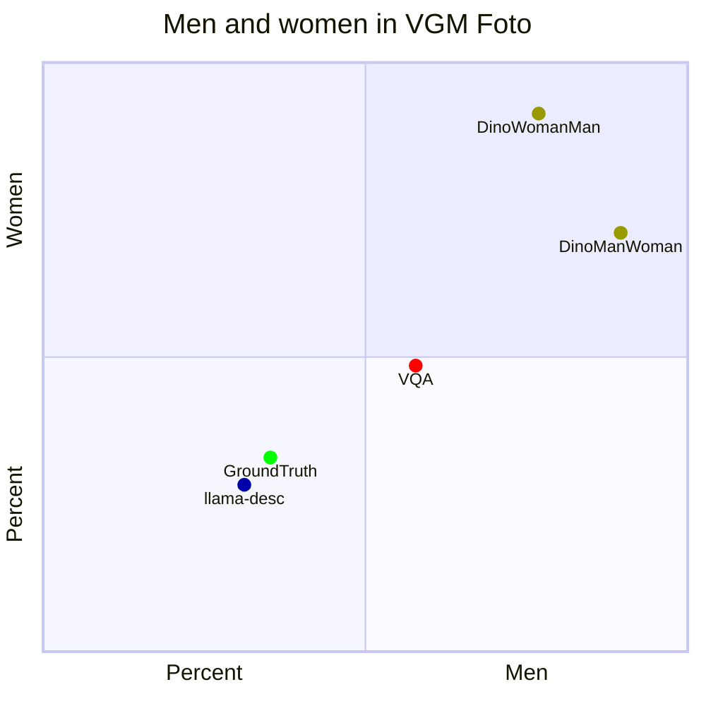
```mermaid
quadrantChart
    title Men and women in VGM Foto
    x-axis Percent --> Men
    y-axis Percent --> Women
    DinoManWoman: [0.8959537572254336, 0.7109826589595376] color: #999900
    DinoWomanMan: [0.7687861271676301, 0.9132947976878613] color: #999900
    GroundTruth: [0.35260115606936415, 0.32947976878612717] color: #00FF00
    VQA: [0.5780346820809249, 0.48554913294797686] color: #FF0000
    llama-desc: [0.31213872832369943, 0.2832369942196532] color: #0000AA

```

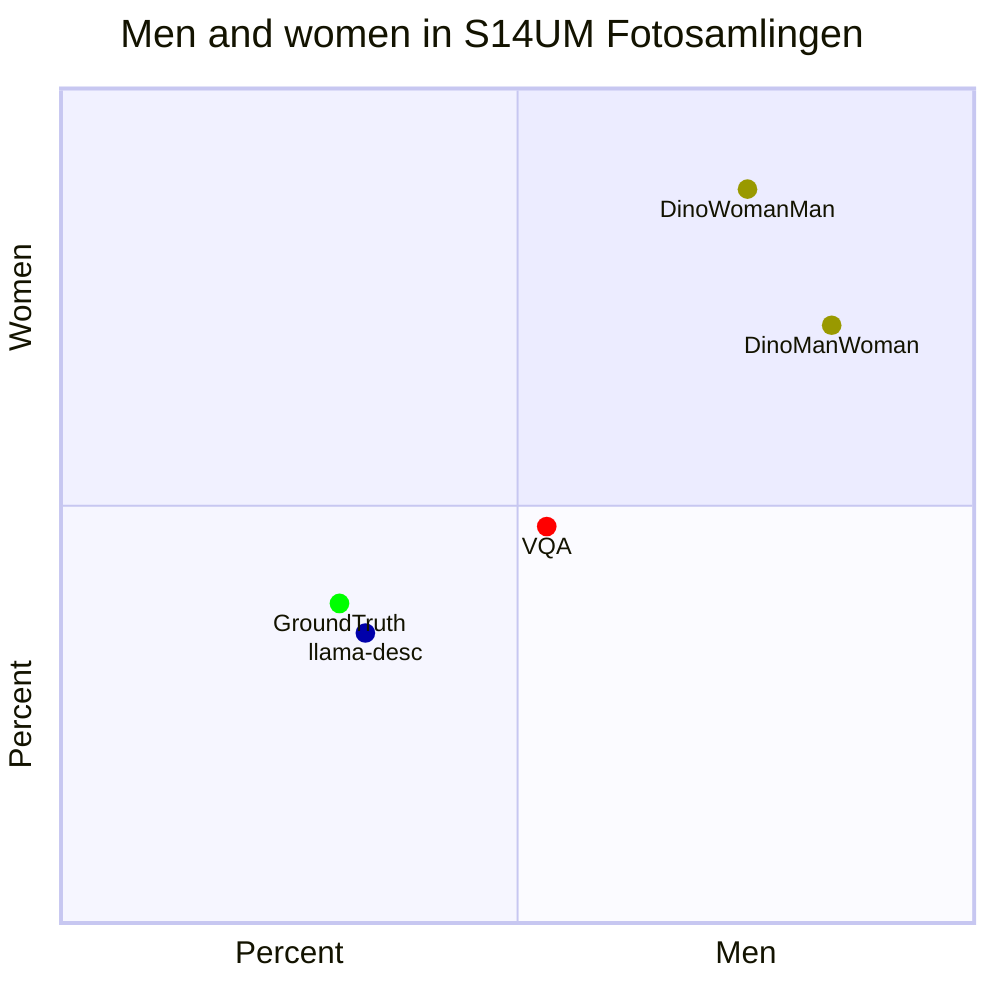
```mermaid
quadrantChart
    title Men and women in S14UM Fotosamlingen
    x-axis Percent --> Men
    y-axis Percent --> Women
    DinoManWoman: [0.8439716312056738, 0.7163120567375887] color: #999900
    DinoWomanMan: [0.75177304964539, 0.8794326241134752] color: #999900
    GroundTruth: [0.3049645390070922, 0.3829787234042553] color: #00FF00
    VQA: [0.5319148936170213, 0.475177304964539] color: #FF0000
    llama-desc: [0.3333333333333333, 0.3475177304964539] color: #0000AA

```

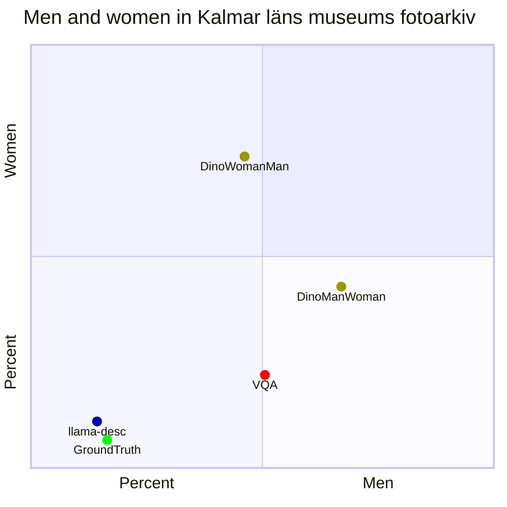
```mermaid
quadrantChart
    title Men and women in Kalmar läns museums fotoarkiv
    x-axis Percent --> Men
    y-axis Percent --> Women
    DinoManWoman: [0.6703296703296703, 0.42857142857142855] color: #999900
    DinoWomanMan: [0.46153846153846156, 0.7362637362637363] color: #999900
    GroundTruth: [0.16483516483516483, 0.06593406593406594] color: #00FF00
    VQA: [0.5054945054945055, 0.21978021978021978] color: #FF0000
    llama-desc: [0.14285714285714285, 0.10989010989010989] color: #0000AA

```

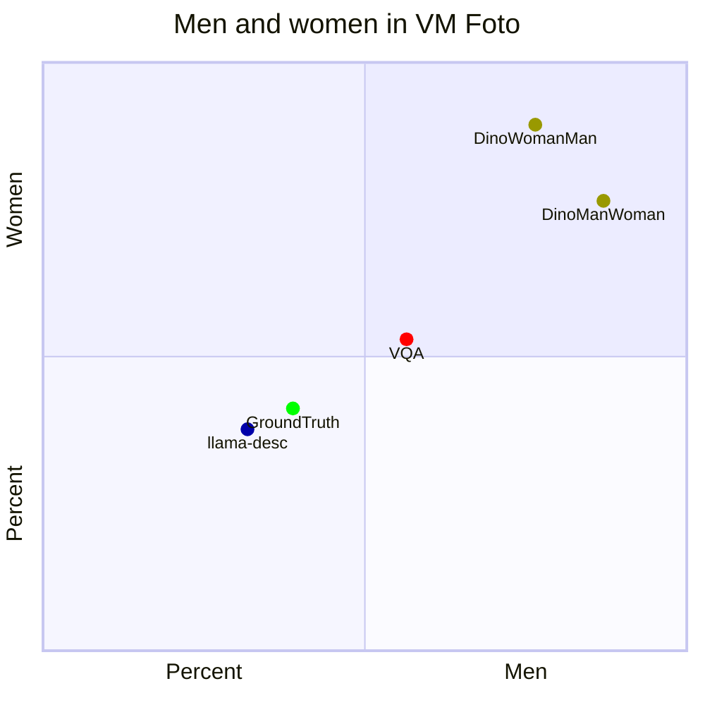
```mermaid
quadrantChart
    title Men and women in VM Foto
    x-axis Percent --> Men
    y-axis Percent --> Women
    DinoManWoman: [0.8705882352941177, 0.7647058823529411] color: #999900
    DinoWomanMan: [0.7647058823529411, 0.8941176470588236] color: #999900
    GroundTruth: [0.38823529411764707, 0.4117647058823529] color: #00FF00
    VQA: [0.5647058823529412, 0.5294117647058824] color: #FF0000
    llama-desc: [0.3176470588235294, 0.3764705882352941] color: #0000AA

```

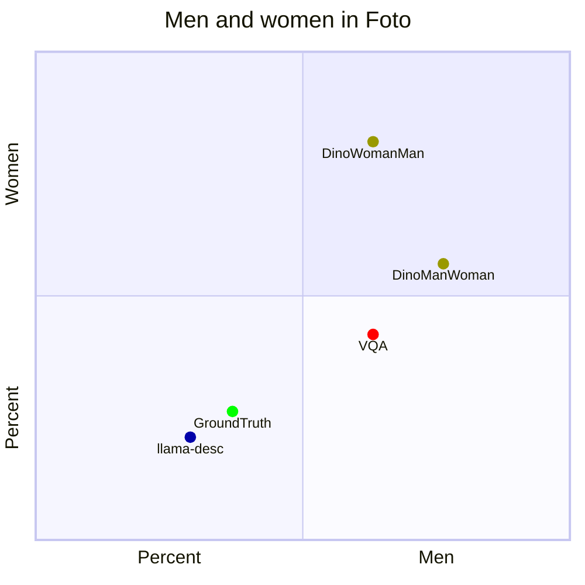
```mermaid
quadrantChart
    title Men and women in Foto
    x-axis Percent --> Men
    y-axis Percent --> Women
    DinoManWoman: [0.7631578947368421, 0.5657894736842105] color: #999900
    DinoWomanMan: [0.631578947368421, 0.8157894736842105] color: #999900
    GroundTruth: [0.3684210526315789, 0.2631578947368421] color: #00FF00
    VQA: [0.631578947368421, 0.42105263157894735] color: #FF0000
    llama-desc: [0.2894736842105263, 0.21052631578947367] color: #0000AA

```

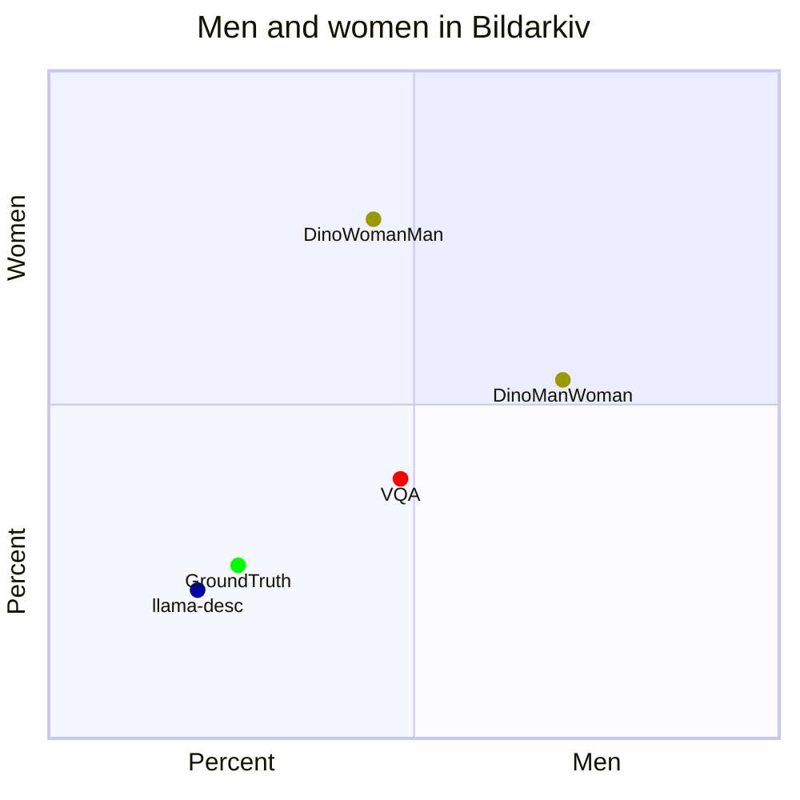
```mermaid
quadrantChart
    title Men and women in Bildarkiv
    x-axis Percent --> Men
    y-axis Percent --> Women
    DinoManWoman: [0.7037037037037037, 0.5370370370370371] color: #999900
    DinoWomanMan: [0.4444444444444444, 0.7777777777777778] color: #999900
    GroundTruth: [0.25925925925925924, 0.25925925925925924] color: #00FF00
    VQA: [0.48148148148148145, 0.3888888888888889] color: #FF0000
    llama-desc: [0.2037037037037037, 0.2222222222222222] color: #0000AA

```

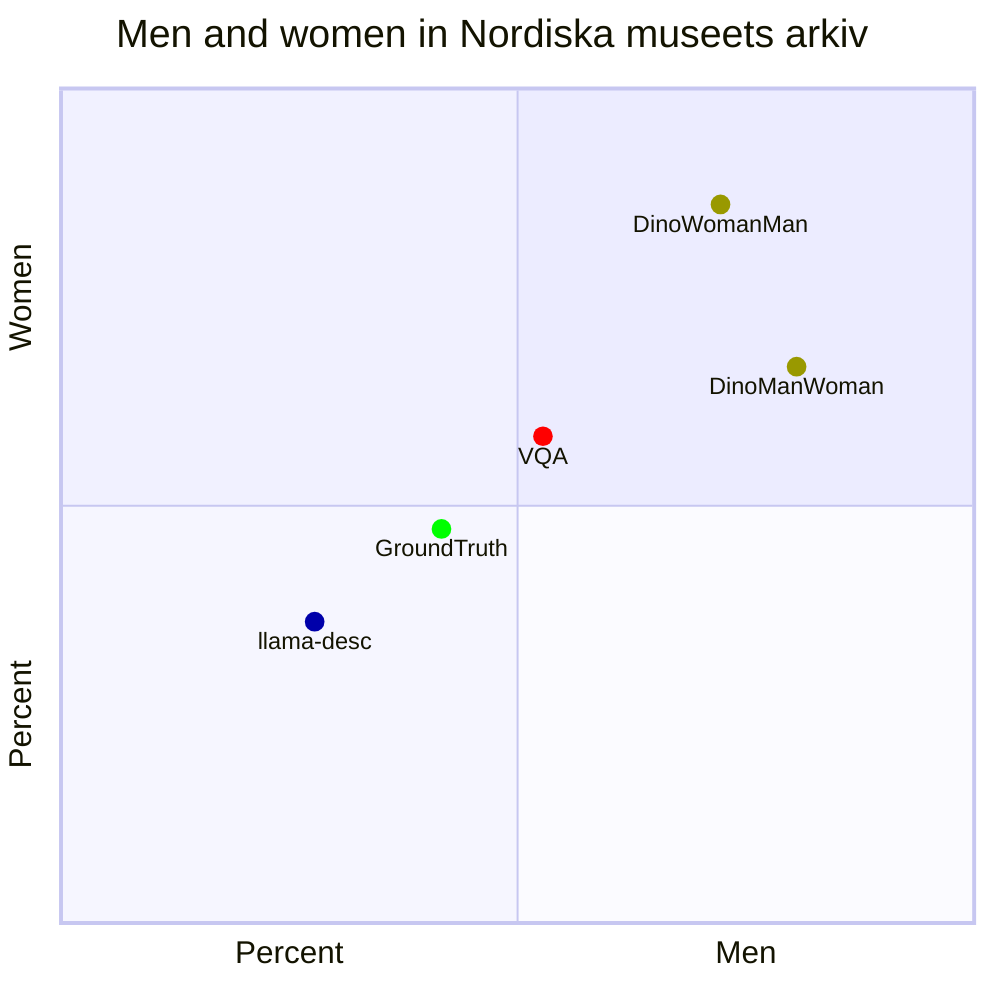
```mermaid
quadrantChart
    title Men and women in Nordiska museets arkiv
    x-axis Percent --> Men
    y-axis Percent --> Women
    DinoManWoman: [0.8055555555555556, 0.6666666666666666] color: #999900
    DinoWomanMan: [0.7222222222222222, 0.8611111111111112] color: #999900
    GroundTruth: [0.4166666666666667, 0.4722222222222222] color: #00FF00
    VQA: [0.5277777777777778, 0.5833333333333334] color: #FF0000
    llama-desc: [0.2777777777777778, 0.3611111111111111] color: #0000AA

```
