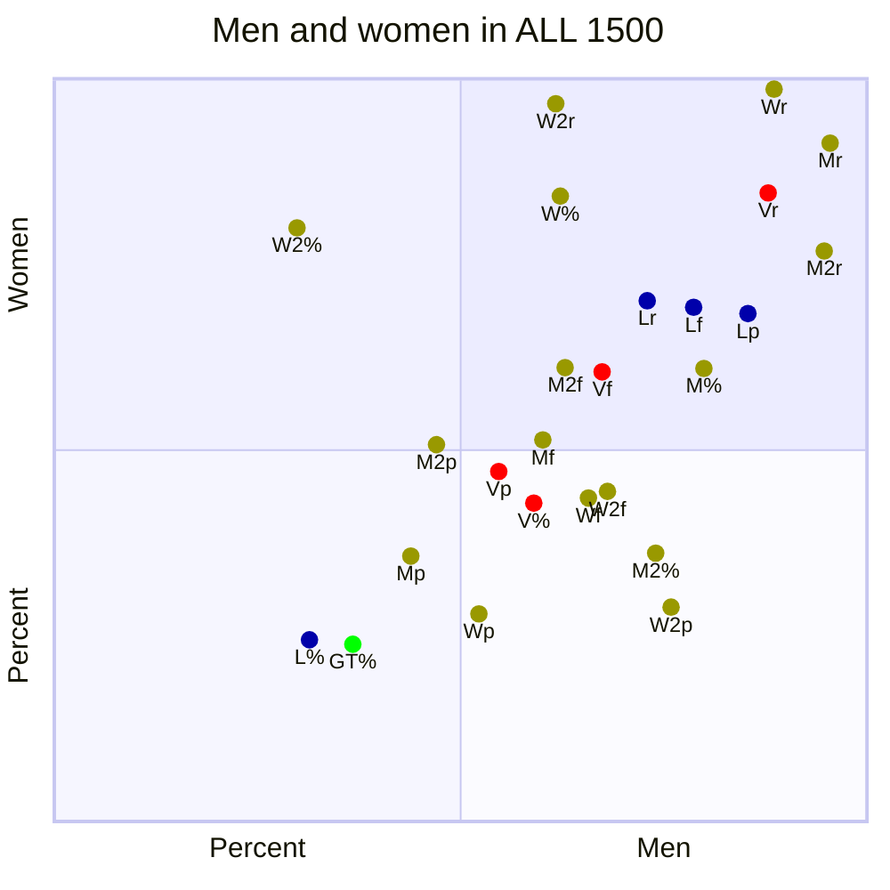
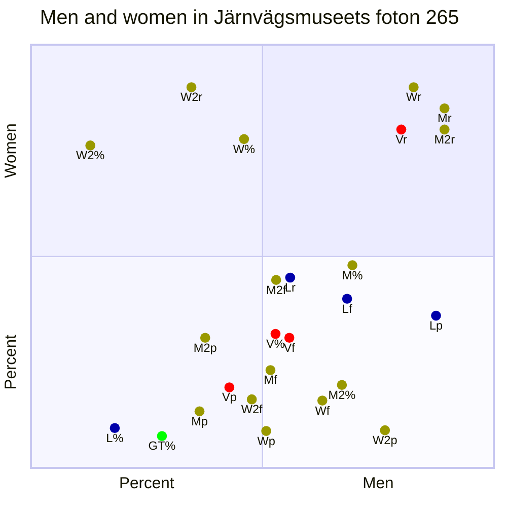
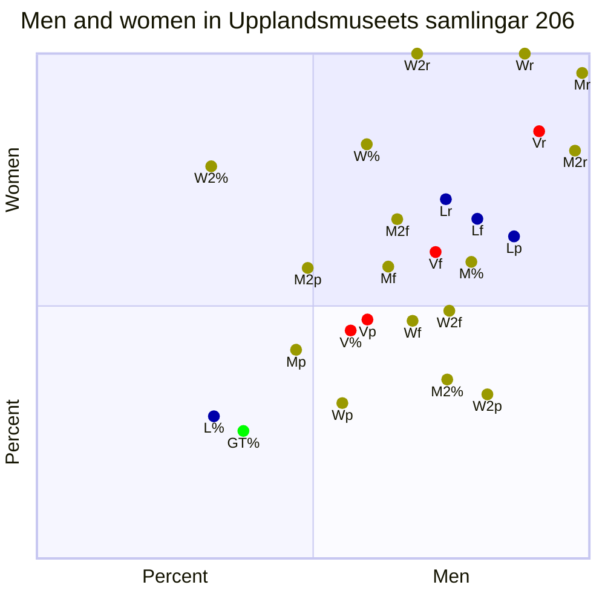
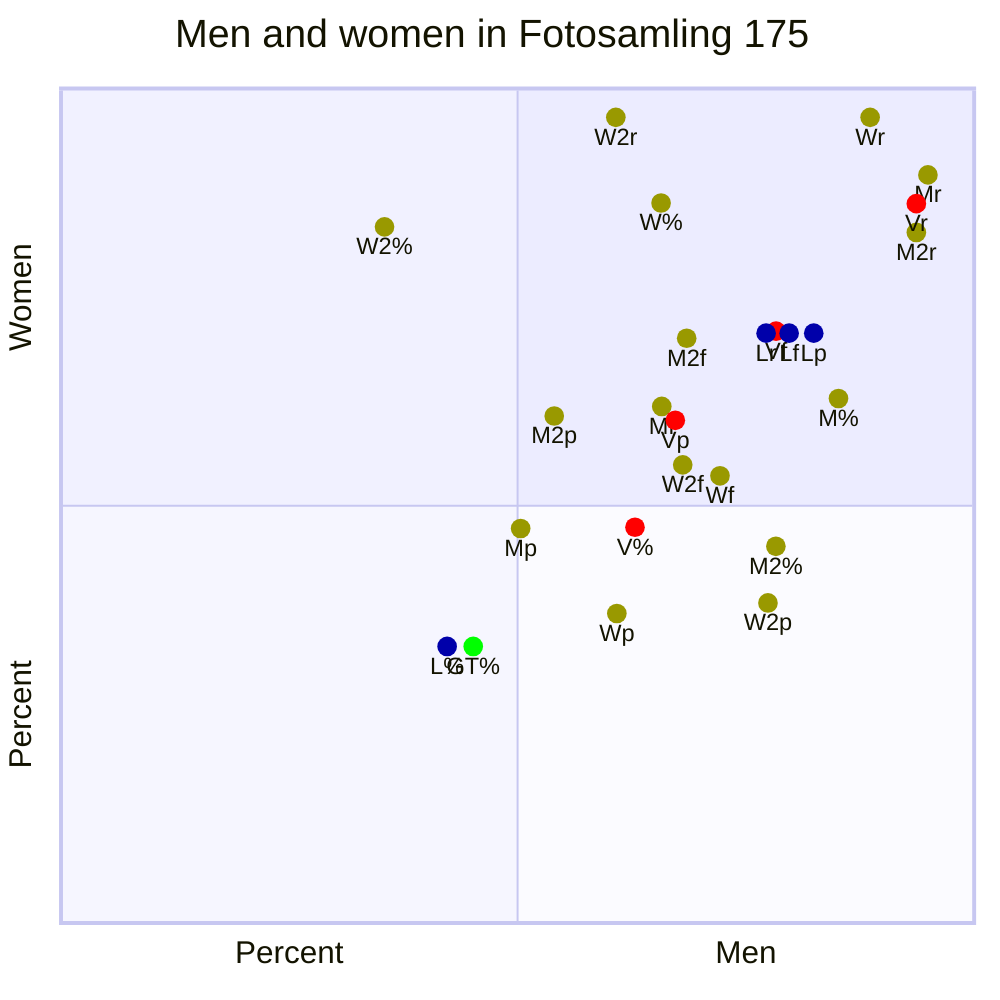
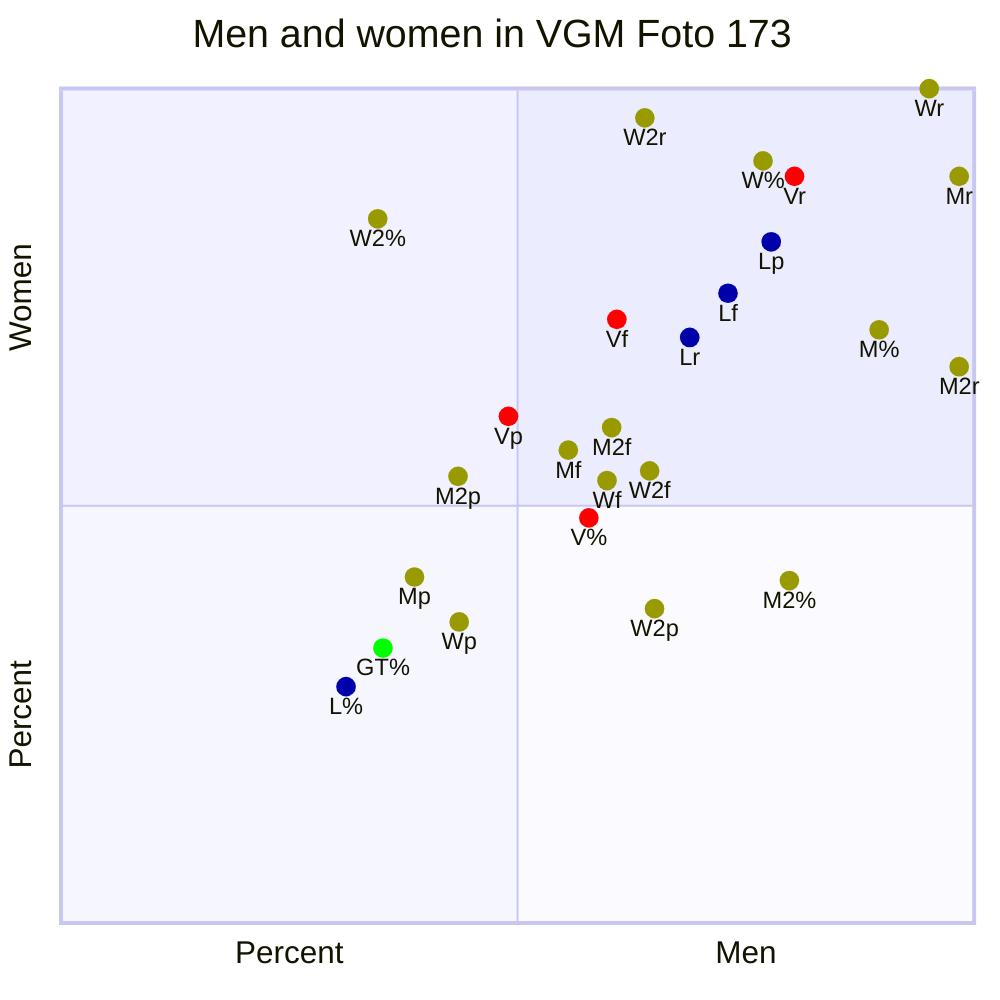
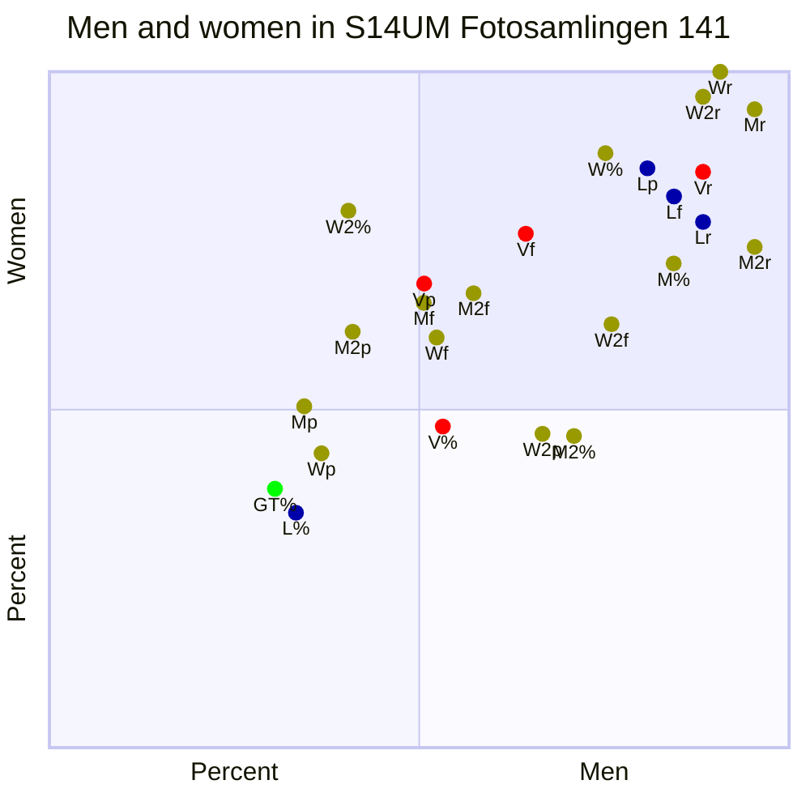
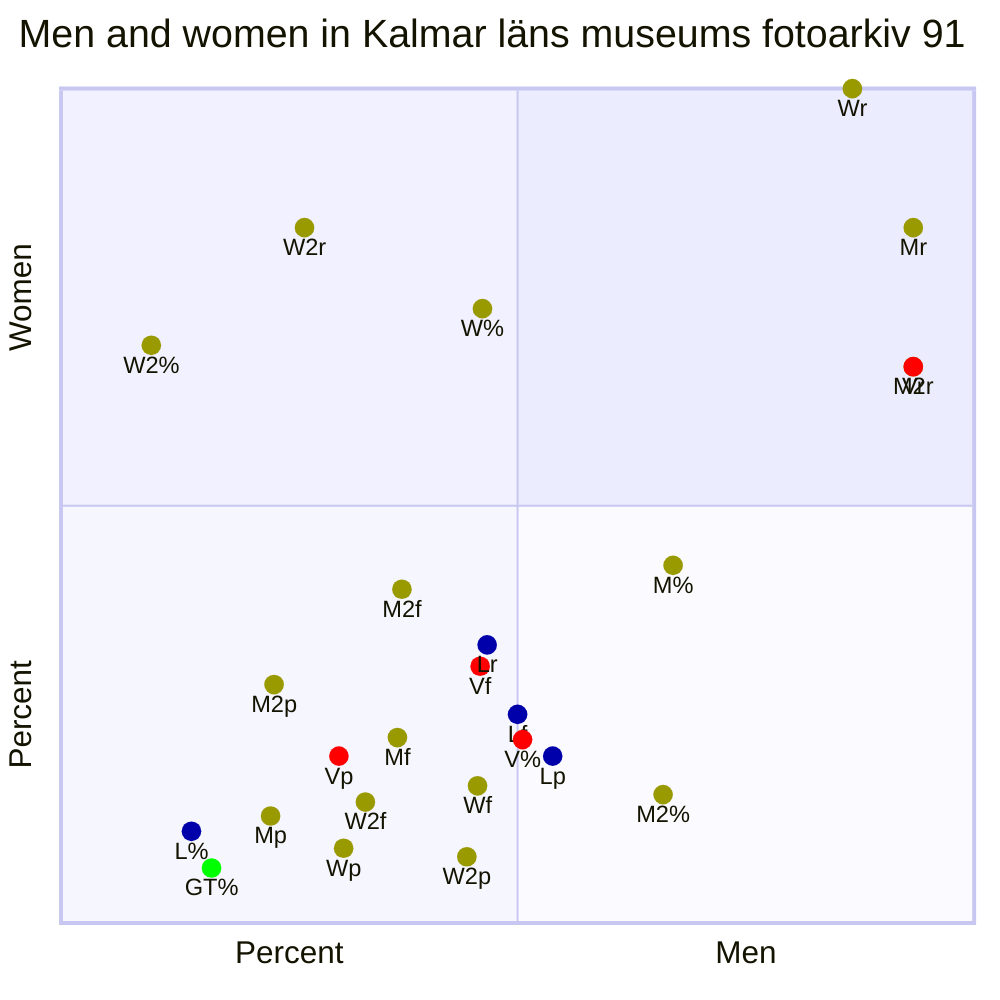
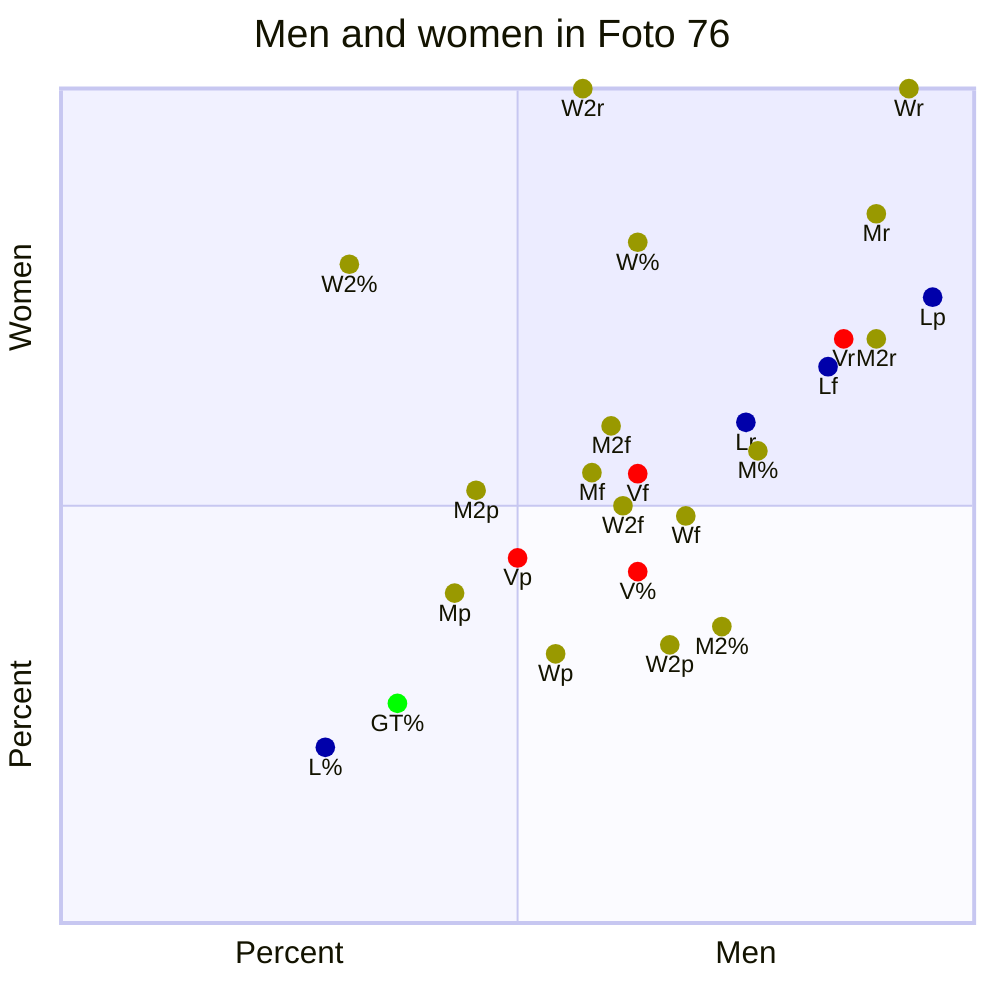
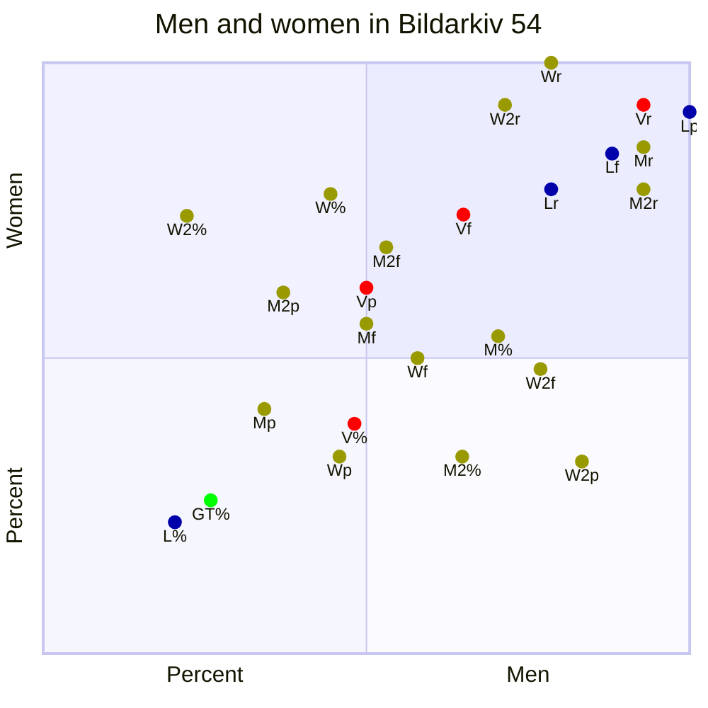
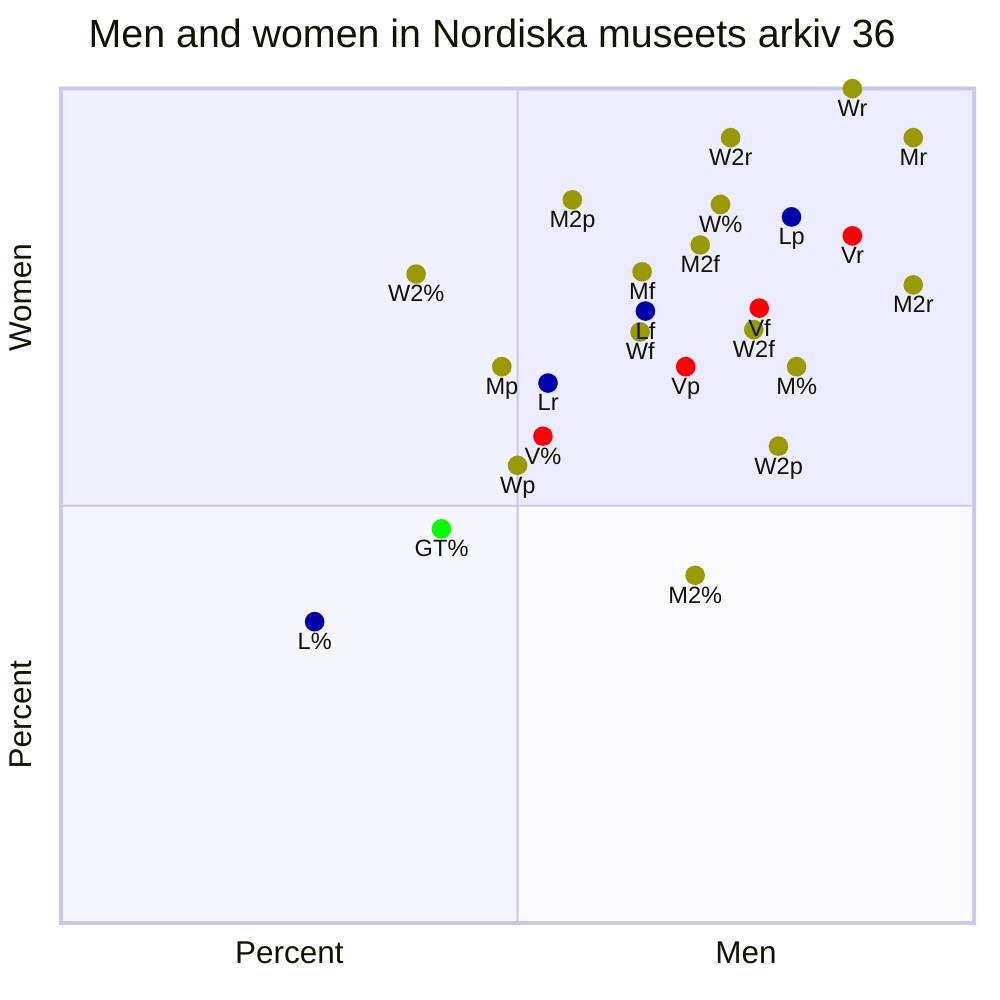

# Scatter found classes

 - **X-axis**: Ratio of images with men.
 - **Y-axis**: Ratio of images with women.

| Color | Model | | Symbol | Metric |
| ---   |:--- | --- | ---: |:---    |
|| (GT) GroundTruth| | % | Ratio of images with object |
|| (W/M) Dino| | f | F1-score |
|| (L) llama-desc| | p | Precision |
|| (V) VQA| | r | Recall |

